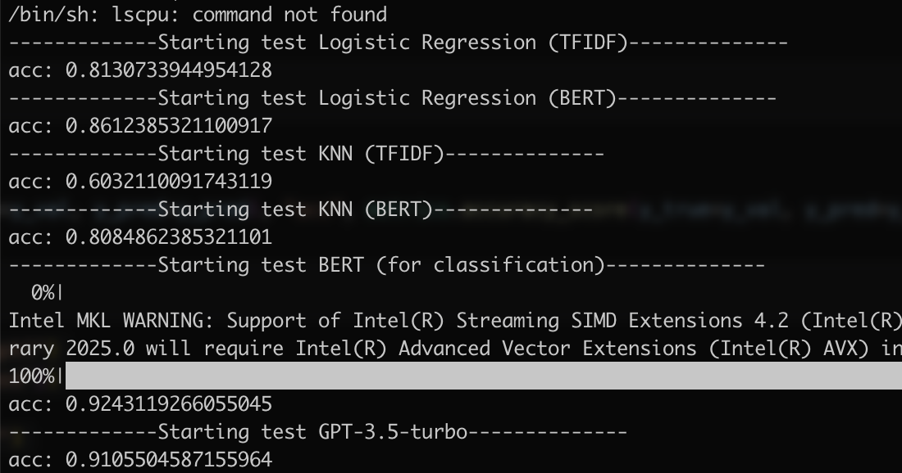

# sentiment-classification
Our Final Project For Data Mining Class in ZJU 23 Spring

### Test Result


### Run test or gradio
1. Define your own settings in `config.py`
2. Run the following commands:
```
python test.py
python gradio_demo.py
```


